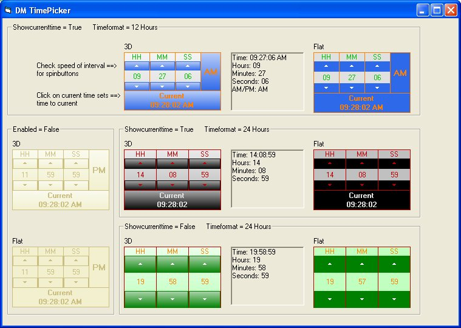



## DM Timepicker

### Description

Colorfull Multilingual timepicker Control.

Style in 3D or Flat.

Timeformat in 24 Hours / 12 Hours with AM/PM.

Showing the current time can be set.
 
### More Info
 
Time in format 24 Hours / 12 Hours with AM/PM.

             |
---                |---
**Submitted On**   |2010-03-03 12:39:12
**By**             |[Frank Donckers](https://github.com/Planet-Source-Code/PSCIndex/blob/master/ByAuthor/frank-donckers.md)
**Level**          |Advanced
**User Rating**    |5.0 (10 globes from 2 users)
**Compatibility**  |VB 6\.0
**Category**       |[Custom Controls/ Forms/  Menus](https://github.com/Planet-Source-Code/PSCIndex/blob/master/ByCategory/custom-controls-forms-menus__1-4.md)
**World**          |[Visual Basic](https://github.com/Planet-Source-Code/PSCIndex/blob/master/ByWorld/visual-basic.md)
**Archive File**   |[DM\_Timepic2176733102010\.zip](https://github.com/Planet-Source-Code/frank-donckers-dm-timepicker__1-72983/archive/master.zip)

